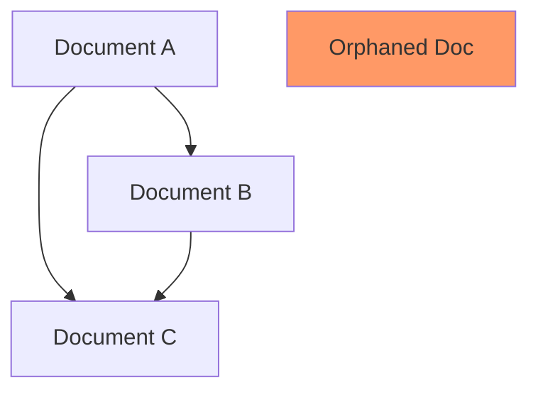

# Design Link Detailed Instructions

Complete step-by-step workflow for generating cross-reference graphs.

## Detailed Workflow

### 1. Parse Parameters

Extract module and format preferences from user request.

**Parameter parsing examples:**

- `/design-link` → module: `all`, format: `mermaid`
- `/design-link effect-type-registry` → module: `effect-type-registry`,
  format: `mermaid`
- `/design-link --format=json` → module: `all`, format: `json`
- `/design-link rspress-plugin --orphans` → module: `rspress-plugin`,
  orphans: `true`

### 2. Load Configuration

Read `.claude/design/design.config.json` to get modules and design docs
paths.

**Configuration structure:**

```json
{
  "modules": {
    "module-name": {
      "path": ".claude/design/module-name",
      "description": "...",
      "enabled": true
    }
  }
}
```

**Configuration loading:**

1. Read design.config.json
2. Parse JSON structure
3. Extract module paths
4. Filter by enabled modules
5. Apply module parameter filter if specified

### 3. Find All Design Documents

Use Glob to find all design docs across modules:

**All modules:**

```bash
for module in ${modules[@]}; do
  glob "*.md" --path=".claude/design/${module}"
done
```

**Specific module:**

```bash
glob "*.md" --path=".claude/design/{module}"
```

**Document discovery:**

1. Iterate through target modules
2. Glob for `*.md` files in each module path
3. Exclude non-design files (README.md, etc.)
4. Build list of document paths
5. Store module association for each doc

### 4. Parse Document References

For each design doc, extract references:

**Frontmatter references:**

```yaml
---
related:
  - path/to/related-doc.md
  - ../other-module/doc.md

dependencies:
  - path/to/dependency-doc.md
---
```

**Content links:**

Extract markdown links to other design docs:

```bash
grep -o '\[.*\](\./.*\.md)' {file}
grep -o '\[.*\](\.\./.*\.md)' {file}
```

**Reference extraction algorithm:**

1. Read first 30 lines of document (frontmatter section)
2. Extract YAML between `---` markers
3. Parse `related` array (bidirectional references)
4. Parse `dependencies` array (directional references)
5. Read entire document
6. Extract markdown links with regex: `\[([^\]]+)\]\(([^)]+\.md)\)`
7. Resolve relative paths to absolute paths
8. Categorize each reference by type

**Reference types:**

- `related`: Bidirectional association
- `dependency`: Directional dependency
- `content-link`: Link from document content
- `backlink`: Reverse of a content-link

### 5. Build Relationship Graph

Create graph data structure with nodes (documents) and edges (references).

**Nodes:**

Each document node contains:

```json
{
  "id": "unique-identifier",
  "path": ".claude/design/module/doc.md",
  "module": "module-name",
  "category": "architecture",
  "status": "current",
  "completeness": 85,
  "title": "Document Title"
}
```

**Edges:**

Each reference edge contains:

```json
{
  "from": "source-doc-id",
  "to": "target-doc-id",
  "type": "related|dependency|content-link",
  "bidirectional": true|false
}
```

**Graph building algorithm:**

1. Create node for each document
2. Extract metadata from frontmatter for node properties
3. Create edge for each reference found
4. Mark bidirectional edges (related, or mutual content-links)
5. Deduplicate edges (same from/to/type)
6. Validate all edge targets exist as nodes
7. Flag broken references

### 6. Analyze Graph

Perform comprehensive graph analysis:

**Orphaned documents:**

Documents with no incoming or outgoing edges.

```text
Algorithm:
1. For each node, count edges where node is source or target
2. If count = 0, mark as orphaned
3. Report orphaned nodes with metadata
```

**Circular dependencies:**

Dependency cycles (A depends on B, B depends on A).

```text
Algorithm:
1. Build directed graph from dependency edges only
2. Perform depth-first search from each node
3. Track visited nodes in current path
4. If revisit a node in current path, cycle detected
5. Report all cycles found
```

**Isolated clusters:**

Groups of connected docs with no external links.

```text
Algorithm:
1. Find connected components using union-find
2. For each component, check for external edges
3. If no edges crossing component boundary, mark isolated
4. Report isolated clusters with member count
```

**Bidirectional references:**

Mutual references between two docs.

```text
Algorithm:
1. For each edge from A to B
2. Check if edge from B to A exists
3. If both exist, mark as bidirectional
4. Count bidirectional vs one-way ratio
```

**One-way references:**

Unreciprocated references.

```text
Algorithm:
1. For each edge from A to B
2. Check if edge from B to A exists
3. If not, mark as one-way
4. Report one-way references for potential improvement
```

**Cross-module references:**

References crossing module boundaries.

```text
Algorithm:
1. For each edge
2. Get source node module
3. Get target node module
4. If modules differ, mark as cross-module
5. Analyze cross-module coupling
```

### 7. Generate Output

Based on format parameter, generate appropriate output.

**Mermaid diagram:**



**Text report:**

```markdown
# Design Documentation Cross-Reference Analysis

## Overview

- Total documents: {count}
- Total references: {count}
- Orphaned documents: {count}
- Circular dependencies: {count}

## Graph Structure

### Module: {module-name}

**Documents ({count}):**
- {doc-1} ({category}, {status})
- {doc-2} ({category}, {status})

**References ({count}):**
- {doc-1} → {doc-2} (dependency)
- {doc-1} ↔ {doc-3} (related)

## Analysis

### Orphaned Documents

{list of orphaned docs with recommendations}

### Circular Dependencies

{list of cycles with suggestions}

### Recommendations

- Add references to connect orphaned docs
- Break circular dependencies
- Balance one-way references
```

**JSON output:**

```json
{
  "nodes": [
    {
      "id": "...",
      "path": "...",
      "module": "...",
      "metadata": {}
    }
  ],
  "edges": [
    {
      "from": "...",
      "to": "...",
      "type": "...",
      "bidirectional": false
    }
  ],
  "analysis": {
    "orphaned": [],
    "circular": [],
    "isolated": [],
    "crossModule": []
  }
}
```

### 8. Provide Recommendations

Suggest improvements based on analysis:

**For orphaned docs:**

1. Search for related topics in other docs
2. Suggest potential cross-references
3. Recommend adding to related docs list
4. Consider if doc should be archived

**For circular dependencies:**

1. Analyze dependency direction
2. Suggest breaking cycles (extract shared concepts)
3. Recommend dependency inversion
4. Consider merging tightly coupled docs

**For one-way references:**

1. Check if reciprocal reference makes sense
2. Suggest adding backlinks
3. Balance reference graph
4. Improve discoverability

**For cross-module references:**

1. Validate cross-module coupling is intentional
2. Document integration points
3. Consider extracting shared concepts
4. Ensure bidirectional documentation

## Advanced Features

### Graph Metrics

Calculate graph metrics:

- **Density:** edges / (nodes * (nodes-1))
- **Average degree:** average edges per node
- **Clustering coefficient:** local clustering
- **Centrality:** most referenced nodes

### Subgraph Extraction

Extract subgraphs:

- Module-specific subgraph
- Category-specific subgraph
- Dependency chain from root doc
- Related docs within N hops

### Change Impact Analysis

Analyze impact of changes:

1. Select changed document
2. Find all referencing documents
3. Trace dependency chains
4. Report affected documentation

### Documentation Coverage

Analyze coverage:

1. Count docs per module
2. Count references per module
3. Identify under-documented modules
4. Recommend documentation priorities
