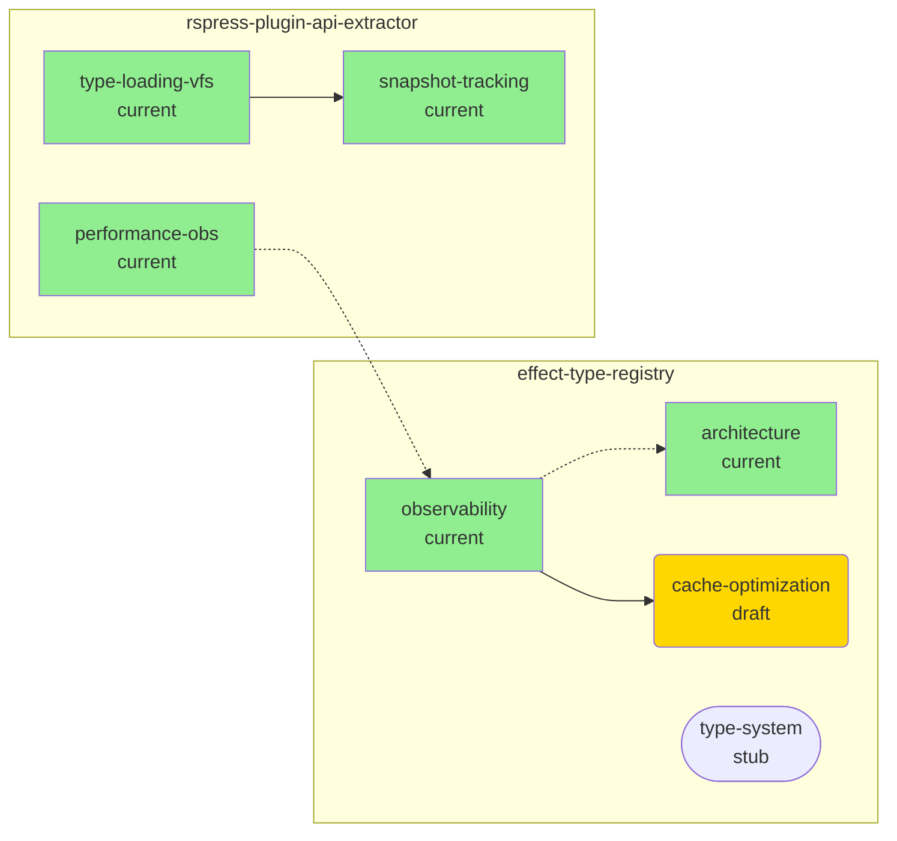

# Output Formats

Visual graph formats and text reports for design documentation relationships.

## Format: Mermaid

Generate Mermaid graph diagram for visual representation.

### Graph Type

Use left-to-right flowchart:

```mermaid
graph LR
```

### Node Styling

**By Module:**

```mermaid
subgraph effect-type-registry
  ETR_obs[observability]
  ETR_arch[architecture]
end

subgraph rspress-plugin-api-extractor
  RPAE_type[type-loading-vfs]
end
```

**By Status:**

Different shapes for different document statuses:

- **current**: Rectangle `[doc]`
- **draft**: Rounded rectangle `(doc)`
- **stub**: Stadium `([doc])`
- **archived**: Hexagon `{{doc}}`

### Edge Styling

**By Relationship Type:**

- **Related**: Dashed line `-.->` (non-directional preference)
- **Dependency**: Solid arrow `-->` (directional, shows dependency flow)
- **Content link**: Dotted line `..->` (reference only)
- **Bidirectional**: Double-ended arrow `<-->` (mutual reference)

**Examples:**

```mermaid
A -.-> B     %% Related
C --> D      %% Dependency
E ..-> F     %% Content link
G <--> H     %% Bidirectional
```

### Complete Mermaid Example



### Mermaid Legend

Include legend explaining visual encoding:

```markdown
**Legend:**

- **Lines:**
  - Solid arrow (→): Dependency (flows from dependent to dependency)
  - Dashed line (-.->): Related (bidirectional relationship)
  - Dotted line (...>): Content link (reference in markdown)

- **Colors:**
  - Green: Current status (up-to-date)
  - Yellow: Draft status (in progress)
  - Gray: Stub status (placeholder)
  - Red border: Orphaned (no references)

- **Shapes:**
  - Rectangle: Current document
  - Rounded: Draft document
  - Stadium: Stub document
  - Hexagon: Archived document
```

### Mermaid Generation Process

1. **Create subgraphs** for each module
2. **Add nodes** with status indicators
3. **Add edges** with appropriate line styles
4. **Apply class definitions** for colors
5. **Assign classes** to nodes based on status
6. **Add legend** for user reference

## Format: Text Report

Generate human-readable text report with analysis.

### Text Report Structure

```markdown
# Design Documentation Cross-Reference Graph

**Generated:** {date}
**Modules:** {count}
**Documents:** {count}
**Total References:** {count}

## Modules

### {module-name} ({doc-count} docs)

**Documents:**

- {doc-name}.md ({status}, {outgoing} out, {incoming} in)
  - Related: {doc} ↔
  - Dependency: {doc} →
  - Referenced by: {doc}

[... more docs ...]

## Analysis

### Orphaned Documents ({count})

1. {module}/{doc} ({status})
   - **Reason:** {why orphaned}
   - **Recommendation:** {action}

### Circular Dependencies ({count})

1. {doc-a} → {doc-b} → {doc-a}
   - **Issue:** {description}
   - **Fix:** {resolution}

### Bidirectional Relationships ({count})

1. {doc-a} ↔ {doc-b}

### One-Way References ({count})

1. {doc-a} → {doc-b}
   - **Suggestion:** Add back-reference

## Recommendations

1. {priority action 1}
2. {priority action 2}
```

### Module Section Format

For each module, list all documents with their relationships:

```markdown
### effect-type-registry (4 docs)

**Documents:**

- observability.md (current, 3 outgoing, 2 incoming)
  - Related: architecture.md ↔ (bidirectional)
  - Dependency: cache-optimization.md → (one-way)
  - Referenced by: rspress-plugin-api-extractor/performance-observability.md

- architecture.md (current, 2 outgoing, 3 incoming)
  - Related: observability.md ↔
  - Related: cache-optimization.md →
  - Referenced by: type-loading-vfs.md, build-architecture.md

- cache-optimization.md (draft, 1 outgoing, 2 incoming)
  - Related: architecture.md ← (incoming only)

- type-system.md (stub, 0 outgoing, 0 incoming) ⚠️  ORPHANED
```

**Symbols:**

- `↔` - Bidirectional (both docs reference each other)
- `→` - Outgoing reference
- `←` - Incoming reference
- `⚠️` - Warning indicator

### Analysis Sections

**Orphaned Documents:**

```markdown
### Orphaned Documents (2)

Documents with no references:

1. effect-type-registry/type-system.md (stub)
   - **Created:** 90 days ago
   - **Completeness:** 5%
   - **Reason:** No outgoing or incoming references
   - **Recommendation:** Add to architecture.md related docs or archive

2. rspress-plugin-api-extractor/legacy-api.md (archived)
   - **Archived:** 12 days ago
   - **Superseded by:** current-api.md
   - **Recommendation:** No action needed (archived correctly)

**Summary:** 1 requires action, 1 is correctly archived
```

**Circular Dependencies:**

```markdown
### Circular Dependencies (1)

Detected dependency cycles:

1. **cache-optimization → observability → cache-optimization**
   - **Type:** Direct circular dependency
   - **Issue:** Both docs depend on each other
   - **Impact:** Creates dependency deadlock
   - **Fix:** Change one relationship:
     - Option 1: observability depends on cache-optimization (one-way)
     - Option 2: Both should be 'related' instead of 'dependency'
   - **Recommendation:** Use option 2 - change both to 'related'
```

**Bidirectional Relationships:**

```markdown
### Bidirectional Relationships (5)

Docs that reference each other (healthy cross-referencing):

1. effect-type-registry/observability.md ↔ architecture.md (related)
2. rspress-plugin-api-extractor/type-loading-vfs.md ↔
   snapshot-tracking.md (related)
3. effect-type-registry/cache-optimization.md ↔ observability.md
   (dependency - circular!)
4. rspress-plugin-api-extractor/build-architecture.md ↔
   type-loading-vfs.md (content-link)
5. effect-type-registry/architecture.md ↔ observability.md (related)

**Note:** #3 is flagged as circular dependency
```

**One-Way References:**

```markdown
### One-Way References (8)

Unreciprocated references (consider adding back-references):

1. effect-type-registry/cache-optimization.md → architecture.md
   - **Type:** related
   - **Suggestion:** Add cache-optimization to architecture.md related docs
   - **Benefit:** Improves discoverability

2. rspress-plugin-api-extractor/performance-observability.md →
   effect-type-registry/observability.md
   - **Type:** content-link
   - **Suggestion:** Consider adding cross-module relationship
   - **Benefit:** Documents integration pattern

[... more one-way refs ...]

**Summary:** 8 potential bidirectional upgrades
```

### Recommendations Section

Prioritized action items:

```markdown
## Recommendations

### Immediate Actions (High Priority)

1. **Resolve circular dependency**
   - File: cache-optimization.md ↔ observability.md
   - Action: Change both to 'related' relationship
   - Effort: 5 minutes

2. **Fix orphaned stub**
   - File: type-system.md
   - Action: Add to architecture.md related docs or archive
   - Effort: 10 minutes

### Short-term Actions (Medium Priority)

3. **Add back-references** (8 docs)
   - Improves navigation and discoverability
   - Effort: 30 minutes total

4. **Review cross-module links** (3 docs)
   - Document integration patterns
   - Add to frontmatter if appropriate
   - Effort: 15 minutes

### Long-term Actions (Low Priority)

5. **Complete stub documents** (2 docs)
   - Will naturally gain references as completed
   - Effort: Varies by document

6. **Review archived docs** (1 doc)
   - Verify archival is appropriate
   - Update references if needed
   - Effort: 10 minutes
```

## Format: JSON

Generate machine-readable JSON for programmatic consumption.

### JSON Structure

```json
{
  "metadata": {
    "generated": "2026-01-17T10:30:00Z",
    "generator": "design-link",
    "version": "1.0",
    "modules": 3,
    "documents": 12,
    "references": 28
  },
  "nodes": [],
  "edges": [],
  "analysis": {}
}
```

### Node Format

Each document as a node:

```json
{
  "id": "effect-type-registry/observability",
  "path": ".claude/design/effect-type-registry/observability.md",
  "module": "effect-type-registry",
  "filename": "observability.md",
  "category": "observability",
  "status": "current",
  "completeness": 85,
  "created": "2025-12-01",
  "updated": "2026-01-15",
  "last_synced": "2026-01-10",
  "outgoing_edges": 3,
  "incoming_edges": 2,
  "degree": 5
}
```

### Edge Format

Each reference as an edge:

```json
{
  "id": "edge-1",
  "from": "effect-type-registry/observability",
  "to": "effect-type-registry/architecture",
  "type": "related",
  "bidirectional": true,
  "source": "frontmatter"
}
```

**Edge properties:**

- `id`: Unique edge identifier
- `from`: Source document ID
- `to`: Target document ID
- `type`: Relationship type (related, dependency, content-link)
- `bidirectional`: Boolean indicating if reciprocated
- `source`: Where edge was found (frontmatter, content)

### Analysis Format

Graph analysis results:

```json
{
  "analysis": {
    "orphaned_docs": [
      {
        "id": "effect-type-registry/type-system",
        "status": "stub",
        "age_days": 90,
        "reason": "no_references",
        "recommendation": "add_to_architecture_related"
      }
    ],
    "circular_dependencies": [
      {
        "cycle": [
          "effect-type-registry/cache-optimization",
          "effect-type-registry/observability",
          "effect-type-registry/cache-optimization"
        ],
        "length": 2,
        "severity": "high",
        "fix": "change_to_related"
      }
    ],
    "isolated_clusters": [],
    "bidirectional_count": 5,
    "one_way_count": 8,
    "cross_module_count": 3,
    "metrics": {
      "density": 0.42,
      "average_degree": 2.3,
      "clustering_coefficient": 0.67
    }
  }
}
```

### Complete JSON Example

```json
{
  "metadata": {
    "generated": "2026-01-17T10:30:00Z",
    "generator": "design-link",
    "version": "1.0",
    "modules": 2,
    "documents": 6,
    "references": 10
  },
  "nodes": [
    {
      "id": "effect-type-registry/observability",
      "path": ".claude/design/effect-type-registry/observability.md",
      "module": "effect-type-registry",
      "filename": "observability.md",
      "category": "observability",
      "status": "current",
      "completeness": 85,
      "created": "2025-12-01",
      "updated": "2026-01-15",
      "last_synced": "2026-01-10",
      "outgoing_edges": 2,
      "incoming_edges": 2,
      "degree": 4
    },
    {
      "id": "effect-type-registry/architecture",
      "path": ".claude/design/effect-type-registry/architecture.md",
      "module": "effect-type-registry",
      "filename": "architecture.md",
      "category": "architecture",
      "status": "current",
      "completeness": 90,
      "created": "2025-11-15",
      "updated": "2026-01-10",
      "last_synced": "2026-01-05",
      "outgoing_edges": 2,
      "incoming_edges": 3,
      "degree": 5
    }
  ],
  "edges": [
    {
      "id": "edge-1",
      "from": "effect-type-registry/observability",
      "to": "effect-type-registry/architecture",
      "type": "related",
      "bidirectional": true,
      "source": "frontmatter"
    },
    {
      "id": "edge-2",
      "from": "effect-type-registry/observability",
      "to": "effect-type-registry/cache-optimization",
      "type": "dependency",
      "bidirectional": false,
      "source": "frontmatter"
    }
  ],
  "analysis": {
    "orphaned_docs": [
      {
        "id": "effect-type-registry/type-system",
        "status": "stub",
        "age_days": 90,
        "reason": "no_references",
        "recommendation": "add_to_architecture_related"
      }
    ],
    "circular_dependencies": [],
    "isolated_clusters": [],
    "bidirectional_count": 3,
    "one_way_count": 5,
    "cross_module_count": 1,
    "metrics": {
      "density": 0.33,
      "average_degree": 2.0,
      "clustering_coefficient": 0.5
    },
    "recommendations": [
      {
        "priority": "high",
        "type": "fix_orphan",
        "target": "effect-type-registry/type-system",
        "action": "add_references_or_archive"
      },
      {
        "priority": "medium",
        "type": "add_bidirectional",
        "target": "effect-type-registry/cache-optimization",
        "action": "add_back_reference_to_observability"
      }
    ]
  }
}
```

### JSON Usage

**Programmatic access:**

```bash
# Get orphaned docs
jq '.analysis.orphaned_docs' graph.json

# Count circular dependencies
jq '.analysis.circular_dependencies | length' graph.json

# Find high-degree nodes (hubs)
jq '.nodes | sort_by(.degree) | reverse | .[0:5]' graph.json

# Export to other tools
cat graph.json | jq '.edges' > edges.json
```

## Format Selection

**Use Mermaid when:**

- Visual representation needed
- Presenting to stakeholders
- Documentation in markdown files
- Quick overview of structure

**Use Text when:**

- Detailed analysis required
- Command-line review
- Including in reports
- Step-by-step recommendations

**Use JSON when:**

- Programmatic processing
- Integration with other tools
- Generating custom visualizations
- Bulk operations on graph data
